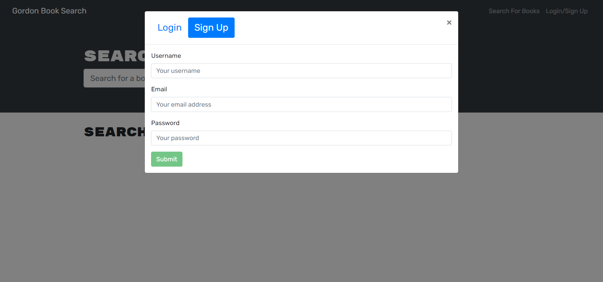
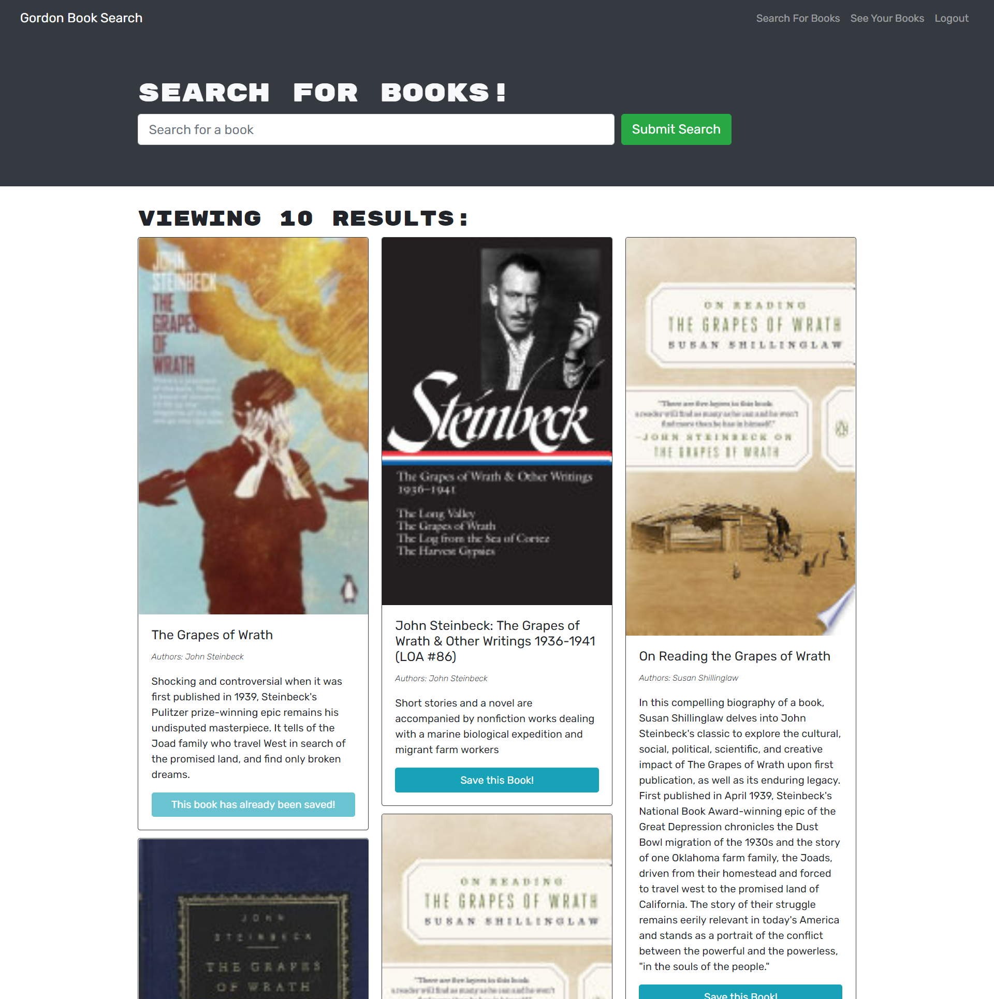
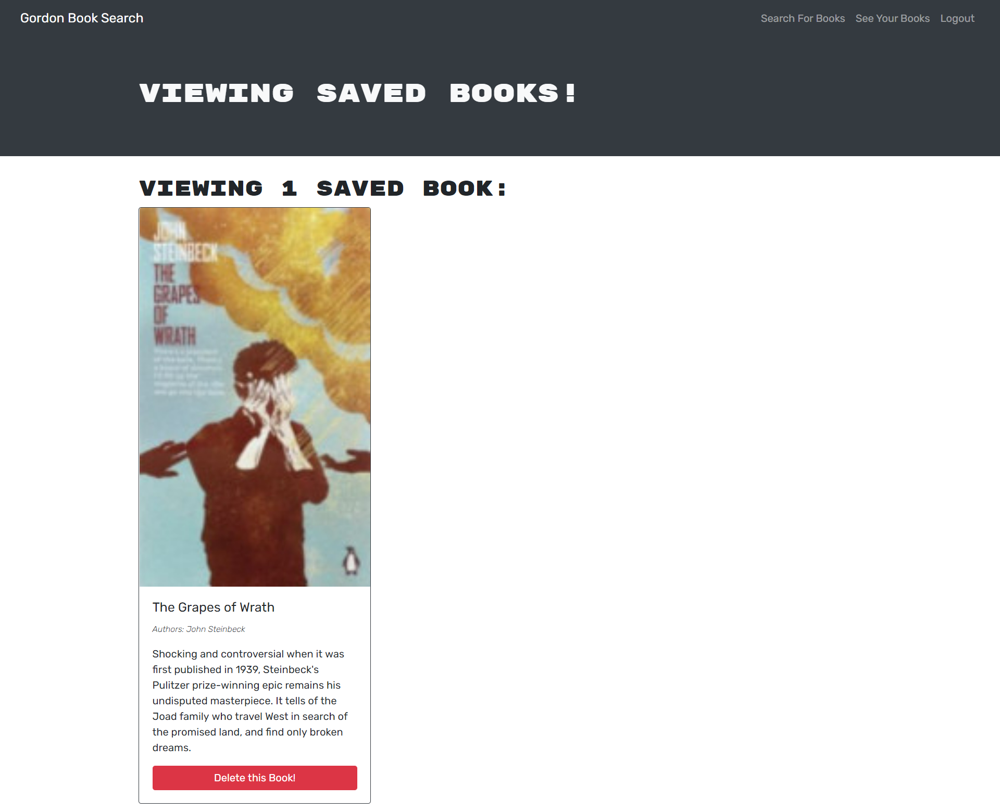

# Gordon Book Search

## Description

This is a MERN stack book search application that uses an Apollo Server to use GraphQL queries and mutations to fetch and modify data. The Apollo server is applied to the Express.js server as middleware and authentication is done by way of jason web tokens.  

Users are able to search for books and, once signed in/logged in, can save books to their list.  Saved books can be deleted so long as the user is still logged in.   The application has been deployed to Heroku [here](https://quiet-oasis-78930.herokuapp.com/).

## Table of Contents

*[Installation](#installation)

*[Usage](#usage)

*[License](#license)

*[Contributing](#contributing)

*[Questions](#questions)

## Installation

Once the repo has been cloned, please run npm install to ensure all dependencies are loaded. To enter development, type npm run develop in the command line.

## Usage

Please see the deployed application [here](https://quiet-oasis-78930.herokuapp.com/).  Once at the homepage, be sure to sign up to enjoy the full functionality of the site.  This application uses JWT for authentication to work in the context of a GraphQL API and is set to timeout at the 2 hour mark.

## License
This application is covered under the [MIT](./License/MIT.txt) license.
  
## Contributing

Pull requests are welcome. For major changes, please open an issue first to discuss what you would like to change.

## Questions

If you have any questions, please contact me by [email](mailto:vprmatrix55@gmail.com) or through [Github](https://github.com/Mike2481)

